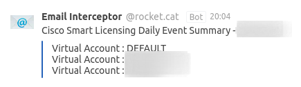

# Rocket.Chat Email notice
Allows you to receive rocket chat notifications about emails from selected addresses and custom body email handling.\

## Usage
###### !!!!!!!! Now the instruction is incomplete, I just started writing, but you can try to use it now, when I have not yet finished the design of the instructions and the docker image
1) Create mail-box ad setup transparent message redirection to it
or
use credentials of existing mail account
2) Copy `config.example.js` -> `config.js`
3) Edit config:\
Set `RC_HOOK_URL` to url of your webhook from rocketchat intergations settings\
Set vars in `imapConfig` to imap credentials for you account

In notifyConfig each object contain filters for email address. You can add as much as you want emails with custom script.\
For Example:
```
export const notifyConfig = {
    "jargez@site.ru": (HTMLBody) => {
        // custom logic possible
        return {
            channel: '@jargez',
            text: HTMLBody // if object isn't edited, then the whole letter will be sent in text form
        }
    },
}
```
Will accept all messages from address jargez@site.ru and send them to the private message channel @jargez in rocketchat in the form of text received from the markup of the entire letter


##### Todo
- [ ] Dockerfile
- [ ] Readme.md
- [ ] Tests
